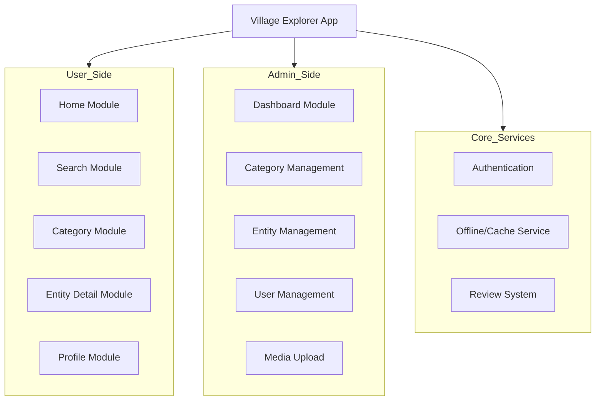
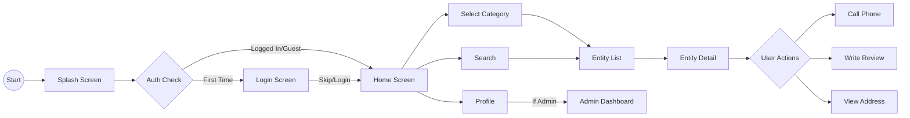
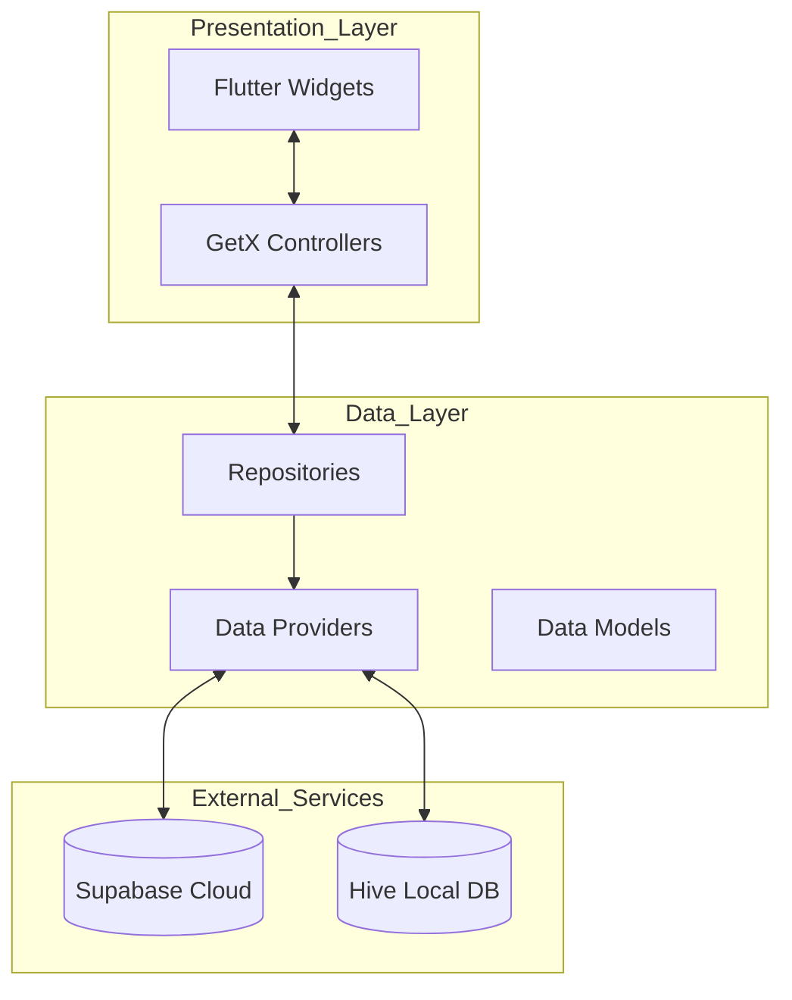
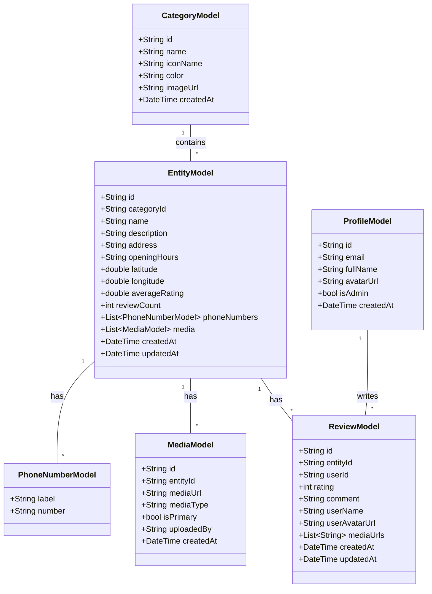

# Village Explorer (村庄探索) - Project Report

## 1. Introduction/Abstract

**Village Explorer (村庄探索)** is a comprehensive mobile application designed to serve as a digital guide for village tourism. Built using **Flutter**, the application targets the Android platform and aims to provide an immersive, culturally rich experience for users exploring the village.

The app allows users to discover various locations (entities) categorized for easy navigation, view detailed information including media galleries, and interact with the community through reviews. It features a distinct **Chinese-style design system**, ensuring the user interface reflects the cultural essence of the village.

Key technical highlights include a robust **offline-first architecture** using Hive for local caching, **Supabase** for real-time backend services (database, authentication, storage), and **GetX** for efficient state management and routing.

## 2. Background

In the era of digital tourism, traditional villages often struggle to present their rich heritage and local businesses to modern travelers. Information is frequently scattered, outdated, or unavailable online.

**Village Explorer** addresses this gap by providing a centralized, easy-to-use platform. It empowers:
*   **Tourists**: To easily find attractions, restaurants, and accommodations with reliable information (opening hours, location, contact).
*   **Locals/Admins**: To manage and update content dynamically without needing technical expertise or app store updates.

The project emphasizes not just utility but also aesthetic alignment with the subject matter, creating a "digital twin" experience of the village's atmosphere.

## 3. Functional Module Diagram

The application is divided into several core functional modules:

### Module Descriptions:
*   **Home Module**: Featured places, category grid, pull-to-refresh.
*   **Category Module**: Filtering entities by category, sorting.
*   **Entity Detail Module**: Image carousel, info display, phone calling, map integration.
*   **Admin Dashboard**: Statistics, content CRUD operations (Create, Read, Update, Delete), user management.
*   **User Management**: Search users, toggle admin roles, delete users with cascade handling.
*   **Offline Service**: Syncs data to local Hive storage for access without internet.

## 4. Logical Flow Diagram

The typical user journey through the application:

## 5. Technical Architecture Diagram

The project follows a clean architecture pattern separated into Presentation, Domain/Data, and External Services.

*   **State Management**: GetX is used for reactive state management, dependency injection, and route management.
*   **Backend**: Supabase provides Postgres database, Authentication (Email/Anonymous), and Storage buckets.
*   **Local Storage**: Hive is used to cache Categories and Entities, enabling the "Offline First" capability.

## 6. Class Diagram

Key classes representing the data model and their relationships:

## 7. Unique Features

### 🏮 Chinese Aesthetic Design System
Unlike standard Material Design apps, Village Explorer implements a custom design language tailored to the cultural context.
*   **Color Palette**: Uses traditional colors like Chinese Red (`#C41E3A`), Imperial Gold (`#FFD700`), and Jade Green (`#00A86B`).
*   **Typography & Icons**: Selected to complement the theme.
*   **Decorative Elements**: Custom borders and gradients inspired by traditional architecture.

### 📡 Robust Offline Support
Recognizing that internet connectivity in rural villages can be spotty, the app implements a sophisticated caching strategy.
*   Data is fetched from Supabase and immediately cached in Hive.
*   If the device is offline, the app seamlessly serves data from the local cache.
*   A visual connectivity indicator informs the user of their sync status.

### 🛡️ Integrated Admin Dashboard
The app includes a full-featured administration panel built directly into the mobile client.
*   Admins can add/edit/delete categories and entities on the go.
*   Includes media upload capabilities (Camera/Gallery) directly to Supabase Storage.
*   Real-time statistics view (users, categories, entities, reviews).
*   **User Management**: Search and manage users, toggle admin status, and delete users with proper cascade handling for related data (reviews, media references).

### 👤 Flexible Authentication & User Management
*   **Guest Mode**: Allows tourists to explore immediately without friction.
*   **User Accounts**: Enables interactive features like Reviews.
*   **Role-Based Security**: Simple boolean `is_admin` flag controls access. Row Level Security (RLS) in Supabase ensures only admins can modify core content, while users can manage their own reviews.
*   **Admin Controls**: Admins can promote/demote other users, with self-modification prevention to avoid accidental privilege loss.
*   **Safe User Deletion**: When deleting users, the system properly handles foreign key constraints by nullifying media upload references while cascading review deletions.
