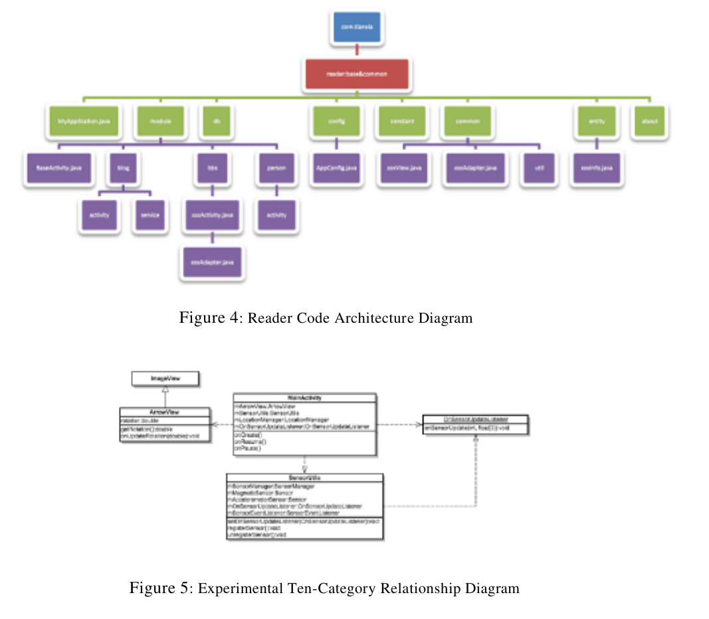

Final Project Requirements
1. Project Theme
Students can choose their own app theme or topic (self-defined theme). Creativity and
originality are strongly encouraged. The project should demonstrate the student’s ability
to design, implement, and document a complete Android application.
2. Technical Requirements:
Applications will be evaluated according to the following complexity levels:
Level
Failing
Level
Pass Level
Good Level
Very Good
Level
Excellent
Level
Description
Unable to implement a basic application. Lacks understanding of the Android application
lifecycle or cannot use an IDE (Integrated Development Environment).
Can develop a small or mid-sized application with 3–5 separate views/activities.
Understands the application lifecycle and can use an IDE at a basic level.
Can model and implement an application of moderate complexity — including more than
5 views and a simple data persistence mechanism (e.g., SharedPreferences, SQLite).
Can competently use an IDE and debug applications.
Can implement a more sophisticated application with multiple navigation mechanisms,
local data storage, and basic remote interaction (e.g., using API or online services).
Meets all of the above requirements at a high standard. Demonstrates advanced
interaction with external services/APIs, integrates device sensors (e.g., camera, GPS),
and provides an optimized, user-friendly interface.

1
Introduction
3
1Introduction
Briefly describe the background of the group project, the basic design, and
summarize the unique features of the application — similar to an abstract.
Background
2
Provide a detailed description of the background of the project, analyze the
shortcomings of existing similar applications, and the application concept, scope, and
technology involved. It should be more detailed than the overview, but not a long
one, and focus on the key points.
Finally, the characteristics of the project are described, mainly including
1. Practicality: Is the app useful and meets the needs of users?
2. Innovation: Compared with existing similar applications, is it innovative and
breakthrough?
3. User experience: Is the app simple, easy to use, and user-friendly? How is the
UI design? Is the app stable and fast?
4. Compatibility: Does it support multiple versions and platforms?
5. Does it involve user privacy? Is it safe?
6. Game apps consider speed, graphics, and entertainment
7. ···
Note: You do not need to cover all the above points. You can choose several
or add other content analysis according to your needs.
3Project Description (Key)
3.1Functional Module
Use a functional module diagram to describe the
requirements.
3.2
system's functional
Logical Flow
Explain the business logic process of the application, that is, the processing
process of the application under different user operations.
3.3
Technical Description(Key)
Provide a detailed explanation of the technologies used in the application,
such as databases, cloud servers, and advanced interfaces. It is recommended to
include a technical architecture diagram. First, give an overview of the functions of
each component, then elaborate on the specific implementation methods, with a focus
on the unique technologies and algorithms used in the team.3
Project Description (Key)
3.4
5
Code Architecture
Application code architecture: The classes and relationships used in Java code,
with brief descriptions of each class's purpose. [Avoid extensive code snippets!
Avoid extensive code snippets! Avoid extensive code snippets!] For example,
Figure 4 shows the architecture of a reader, or a class relationship diagram
similar to Experiment 10 (Figure 5).

